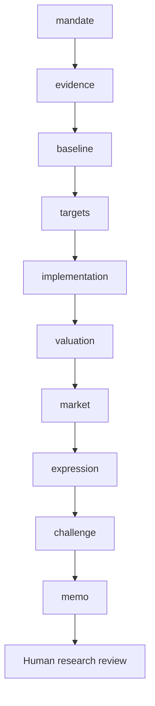

# Workflow

Are the issuer’s targets supported by comparable emissions boundaries, funded implementation and observable delivery?

Routes: `corporate-plan`, `sector-comparison`, `annual-progress`. These named use cases share a sequential evidence/review core; they are not separately calibrated financial models.

| Step | Research task | Stage ID |
|---|---|---|
| 1 | Mandate and investable decision | `mandate` |
| 2 | Evidence intake and reconciliation | `evidence` |
| 3 | Emissions baseline and comparability | `baseline` |
| 4 | Target architecture and applicability | `targets` |
| 5 | Implementation and capital allocation | `implementation` |
| 6 | Progress and financial consequences | `valuation` |
| 7 | Market context and implementation evidence | `market` |
| 8 | Investment-decision handoff | `expression` |
| 9 | Independent challenge and exceptions | `challenge` |
| 10 | Investment committee and accountable review | `memo` |

A COMPLETE artifact is structurally complete, not certified correct. Material gaps stop dependencies. Open MATERIAL/CRITICAL issues block research approval. A source-study intentionally stops after the evidence stage.
